# Miscellaneous Symbols

| &#x2003; | &#x2003; | &#x2003; | &#x2003; | &#x2003; | &#x2003; | &#x2003; | &#x2003; | &#x2003; | &#x2003; | &#x2003; | &#x2003; | &#x2003; | &#x2003; | &#x2003; | &#x2003; |
| :---: | :---: | :---: | :---: | :---: | :---: | :---: | :---: | :---: | :---: | :---: | :---: | :---: | :---: | :---: | :---: |
| | | | [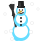](<U+2603-VS16_snowman.svg> "Snowman")| [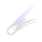](<U+2604-VS16_comet.svg> "Comet")| &#160; | &#160; | &#160; | &#160; | &#160; | &#160; | &#160; | &#160; | &#160; | | &#160; |
| &#160; | | &#160; | &#160; | | | &#160; | &#160; | | &#160; | &#160; | &#160; | &#160; | | &#160; | &#160; |
| | &#160; | | | &#160; | [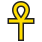](<U+2625-VS16_ankh.svg> "Ankh")| | &#160; | &#160; | &#160; | | &#160; | &#160; | &#160; | | |
| &#160; | &#160; | &#160; | &#160; | &#160; | &#160; | &#160; | &#160; | | | | &#160; | &#160; | &#160; | &#160; | &#160; |
| | &#160; | | &#160; | &#160; | &#160; | &#160; | &#160; | | | | | | | | |
| | | | | &#160; | &#160; | &#160; | &#160; | &#160; | &#160; | &#160; | &#160; | &#160; | &#160; | &#160; | |
| | &#160; | &#160; | | &#160; | | | &#160; | | &#160; | &#160; | &#160; | &#160; | &#160; | &#160; | &#160; |
| &#160; | &#160; | &#160; | &#160; | &#160; | &#160; | &#160; | &#160; | &#160; | &#160; | &#160; | | &#160; | &#160; | | |
| &#160; | &#160; | &#160; | &#160; | &#160; | &#160; | &#160; | &#160; | &#160; | &#160; | &#160; | &#160; | &#160; | &#160; | &#160; | &#160; |
| &#160; | &#160; | | | | [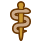](<U+2695-VS16_staff_of_aesculapius.svg> "Staff of AEsculapius")| | | &#160; | | &#160; | | | &#160; | &#160; | &#160; |
| | | &#160; | &#160; | &#160; | &#160; | &#160; | | &#160; | &#160; | | | &#160; | &#160; | &#160; | &#160; |
| [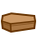](<U+26B0-VS16_coffin.svg> "Coffin")| | &#160; | &#160; | &#160; | &#160; | &#160; | &#160; | &#160; | &#160; | &#160; | &#160; | &#160; | | | &#160; |
| &#160; | &#160; | &#160; | &#160; | | | &#160; | &#160; | [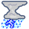](<U+26C8-VS16_thunder_cloud_and_rain.svg> "Thunder cloud and rain")| &#160; | &#160; | &#160; | &#160; | &#160; | | [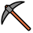](<U+26CF-VS16_pick.svg> "Pick")|
| &#160; | | &#160; | | | &#160; | &#160; | &#160; | &#160; | &#160; | &#160; | &#160; | &#160; | &#160; | &#160; | &#160; |
| &#160; | &#160; | &#160; | &#160; | &#160; | &#160; | &#160; | &#160; | &#160; | | | &#160; | &#160; | &#160; | &#160; | &#160; |
| | | [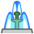](<U+26F2_fountain.svg> "Fountain")| | | | &#160; | [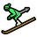](<U+26F7-VS16_skier.svg> "Skier")| | [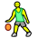](<#u26f9-vs16> "Person with ball")| | &#160; | &#160; | |

## U+2602-VS16

- 
- 

## U+261D-VS16

- 
- 
- 
- 
- 
- 

## U+2639-VS16

- 
- 

## U+263A-VS16

- 
- 

## U+26F9-VS16

- 
- 
- <a href="U+26F9-U+1F3FB-ZWJ-U+2642-VS16_man_bouncing_ball_light_skin_tone.svg" title="Man bouncing ball, light skin tone">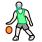</a>
- <a href="U+26F9-U+1F3FB_person_with_ball_light_skin_tone.svg" title="Person with ball, light skin tone">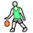</a>
- <a href="U+26F9-U+1F3FC-ZWJ-U+2640-VS16_woman_bouncing_ball_medium-light_skin_tone.svg" title="Woman bouncing ball, medium-light skin tone">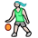</a>
- <a href="U+26F9-U+1F3FC-ZWJ-U+2642-VS16_man_bouncing_ball_medium-light_skin_tone.svg" title="Man bouncing ball, medium-light skin tone">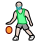</a>
- <a href="U+26F9-U+1F3FC_person_with_ball_medium-light_skin_tone.svg" title="Person with ball, medium-light skin tone">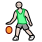</a>
- <a href="U+26F9-U+1F3FD-ZWJ-U+2640-VS16_woman_bouncing_ball_medium_skin_tone.svg" title="Woman bouncing ball, medium skin tone">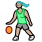</a>
- <a href="U+26F9-U+1F3FD-ZWJ-U+2642-VS16_man_bouncing_ball_medium_skin_tone.svg" title="Man bouncing ball, medium skin tone">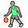</a>
- <a href="U+26F9-U+1F3FD_person_with_ball_medium_skin_tone.svg" title="Person with ball, medium skin tone">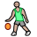</a>
- <a href="U+26F9-U+1F3FE-ZWJ-U+2640-VS16_woman_bouncing_ball_medium-dark_skin_tone.svg" title="Woman bouncing ball, medium-dark skin tone">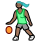</a>
- <a href="U+26F9-U+1F3FE-ZWJ-U+2642-VS16_man_bouncing_ball_medium-dark_skin_tone.svg" title="Man bouncing ball, medium-dark skin tone">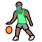</a>
- <a href="U+26F9-U+1F3FE_person_with_ball_medium-dark_skin_tone.svg" title="Person with ball, medium-dark skin tone">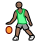</a>
- <a href="U+26F9-U+1F3FF-ZWJ-U+2640-VS16_woman_bouncing_ball_dark_skin_tone.svg" title="Woman bouncing ball, dark skin tone">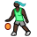</a>
- <a href="U+26F9-U+1F3FF-ZWJ-U+2642-VS16_man_bouncing_ball_dark_skin_tone.svg" title="Man bouncing ball, dark skin tone">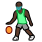</a>
- <a href="U+26F9-U+1F3FF_person_with_ball_dark_skin_tone.svg" title="Person with ball, dark skin tone">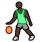</a>
- <a href="U+26F9-VS16-ZWJ-U+2640-VS16_woman_bouncing_ball.svg" title="Woman bouncing ball">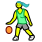</a>
- <a href="U+26F9-VS16-ZWJ-U+2642-VS16_man_bouncing_ball.svg" title="Man bouncing ball">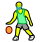</a>
