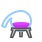
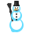
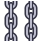
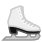

# Miscellaneous Symbols

| &#x2003; | &#x2003; | &#x2003; | &#x2003; | &#x2003; | &#x2003; | &#x2003; | &#x2003; | &#x2003; | &#x2003; | &#x2003; | &#x2003; | &#x2003; | &#x2003; | &#x2003; | &#x2003; |
| :---: | :---: | :---: | :---: | :---: | :---: | :---: | :---: | :---: | :---: | :---: | :---: | :---: | :---: | :---: | :---: |
| | | | | | &#160; | &#160; | &#160; | &#160; | &#160; | &#160; | &#160; | &#160; | &#160; | | &#160; |
| &#160; | | &#160; | &#160; | | | &#160; | &#160; | | &#160; | &#160; | &#160; | &#160; | | &#160; | &#160; |
| | &#160; | | | &#160; | | | &#160; | &#160; | &#160; | | &#160; | &#160; | &#160; | | |
| &#160; | &#160; | &#160; | &#160; | &#160; | &#160; | &#160; | &#160; | | | | &#160; | &#160; | &#160; | &#160; | &#160; |
| | &#160; | | &#160; | &#160; | &#160; | &#160; | &#160; | | | | | | | | |
| | | | | &#160; | &#160; | &#160; | &#160; | &#160; | &#160; | &#160; | &#160; | &#160; | &#160; | &#160; | |
| | &#160; | &#160; | | &#160; | | | &#160; | | &#160; | &#160; | &#160; | &#160; | &#160; | &#160; | &#160; |
| &#160; | &#160; | &#160; | &#160; | &#160; | &#160; | &#160; | &#160; | &#160; | &#160; | &#160; | | &#160; | &#160; | | |
| &#160; | &#160; | &#160; | &#160; | &#160; | &#160; | &#160; | &#160; | &#160; | &#160; | &#160; | &#160; | &#160; | &#160; | &#160; | &#160; |
| &#160; | &#160; | | | | | | | &#160; | | &#160; | | | &#160; | &#160; | &#160; |
| | | &#160; | &#160; | &#160; | &#160; | &#160; | | &#160; | &#160; | | | &#160; | &#160; | &#160; | &#160; |
| | | &#160; | &#160; | &#160; | &#160; | &#160; | &#160; | &#160; | &#160; | &#160; | &#160; | &#160; | | | &#160; |
| &#160; | &#160; | &#160; | &#160; | | | &#160; | &#160; | | &#160; | &#160; | &#160; | &#160; | &#160; | | |
| &#160; | | &#160; | | | &#160; | &#160; | &#160; | &#160; | &#160; | &#160; | &#160; | &#160; | &#160; | &#160; | &#160; |
| &#160; | &#160; | &#160; | &#160; | &#160; | &#160; | &#160; | &#160; | &#160; | | | &#160; | &#160; | &#160; | &#160; | &#160; |
| | | | | | | &#160; | | | | | &#160; | &#160; | |

## U+2602-VS16

- 
- 

## U+261D-VS16

- 
- 
- 
- 
- 
- 

## U+2639-VS16

- 
- 

## U+263A-VS16

- 
- 

## U+267E-VS16

- 
- 

## U+26F9-VS16

- 
- 
- 
- 
- 
- 
- 
- 
- 
- 
- 
- 
- 
- 
- 
- 
- 
- 
