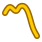

# CJK Symbols and Punctuation

| &#x2003; | &#x2003; | &#x2003; | &#x2003; | &#x2003; | &#x2003; | &#x2003; | &#x2003; | &#x2003; | &#x2003; | &#x2003; | &#x2003; | &#x2003; | &#x2003; | &#x2003; | &#x2003; |
| :---: | :---: | :---: | :---: | :---: | :---: | :---: | :---: | :---: | :---: | :---: | :---: | :---: | :---: | :---: | :---: |
| &#160; | &#160; | &#160; | &#160; | &#160; | &#160; | &#160; | &#160; | &#160; | &#160; | &#160; | &#160; | &#160; | &#160; | &#160; | &#160; |
| &#160; | &#160; | &#160; | &#160; | &#160; | &#160; | &#160; | &#160; | &#160; | &#160; | &#160; | &#160; | &#160; | &#160; | &#160; | &#160; |
| &#160; | &#160; | &#160; | &#160; | &#160; | &#160; | &#160; | &#160; | &#160; | &#160; | &#160; | &#160; | &#160; | &#160; | &#160; | &#160; |
| | &#160; | &#160; | &#160; | &#160; | &#160; | &#160; | &#160; | &#160; | &#160; | &#160; | &#160; | &#160; | |

