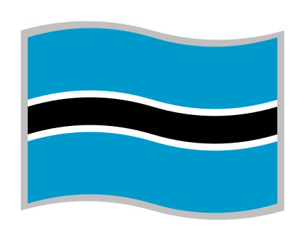
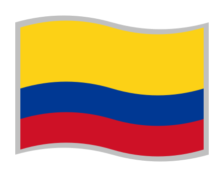
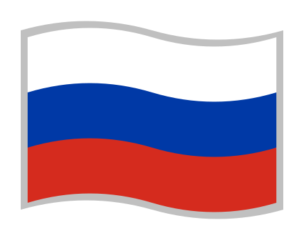
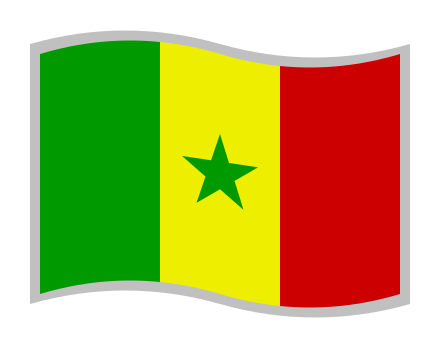
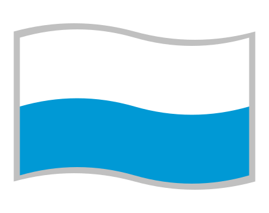
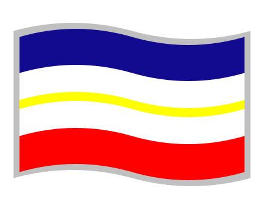

# Flags

| &#x2003; | &#x2003; | &#x2003; | &#x2003; | &#x2003; | &#x2003; | &#x2003; | &#x2003; | &#x2003; | &#x2003; | &#x2003; | &#x2003; | &#x2003; | &#x2003; | &#x2003; | &#x2003; | &#x2003; | &#x2003; | &#x2003; | &#x2003; | &#x2003; | &#x2003; | &#x2003; | &#x2003; | &#x2003; | &#x2003; |
| :---: | :---: | :---: | :---: | :---: | :---: | :---: | :---: | :---: | :---: | :---: | :---: | :---: | :---: | :---: | :---: | :---: | :---: | :---: | :---: | :---: | :---: | :---: | :---: | :---: | :---: |
| &#160; | &#160; | &#160; | &#160; | &#160; | &#160; | &#160; | &#160; | &#160; | &#160; | &#160; | &#160; | &#160; | &#160; | &#160; | &#160; | | &#160; | &#160; | | &#160; | &#160; | &#160; | | &#160; | &#160; |
| &#160; | &#160; | &#160; | &#160; | | | | &#160; | &#160; | | &#160; | &#160; | &#160; | &#160; | &#160; | &#160; | &#160; | | &#160; | &#160; | &#160; | &#160; | | &#160; | &#160; | &#160; |
| &#160; | &#160; | &#160; | | &#160; | | | | | &#160; | &#160; | &#160; | | | | &#160; | &#160; | &#160; | &#160; | &#160; | &#160; | &#160; | &#160; | &#160; | | |
| &#160; | &#160; | &#160; | &#160; | | &#160; | &#160; | &#160; | &#160; | | | &#160; | &#160; | &#160; | | &#160; | &#160; | &#160; | &#160; | &#160; | &#160; | &#160; | &#160; | &#160; | &#160; | |
| &#160; | &#160; | &#160; | &#160; | | &#160; | &#160; | | &#160; | &#160; | &#160; | &#160; | &#160; | &#160; | &#160; | &#160; | &#160; | &#160; | | &#160; | | &#160; | &#160; | &#160; | &#160; | &#160; |
| &#160; | &#160; | &#160; | &#160; | &#160; | &#160; | &#160; | &#160; | | &#160; | &#160; | &#160; | &#160; | &#160; | &#160; | &#160; | &#160; | | &#160; | &#160; | &#160; | &#160; | &#160; | &#160; | &#160; | &#160; |
| | | &#160; | &#160; | &#160; | &#160; | &#160; | | &#160; | &#160; | &#160; | | | &#160; | &#160; | &#160; | &#160; | | &#160; | &#160; | &#160; | &#160; | | &#160; | &#160; | &#160; |
| &#160; | &#160; | &#160; | &#160; | &#160; | &#160; | &#160; | &#160; | &#160; | &#160; | | &#160; | &#160; | &#160; | &#160; | &#160; | &#160; | | &#160; | &#160; | | &#160; | &#160; | &#160; | &#160; | &#160; |
| &#160; | &#160; | &#160; | &#160; | | &#160; | &#160; | &#160; | &#160; | &#160; | &#160; | &#160; | &#160; | &#160; | &#160; | &#160; | &#160; | | | | &#160; | &#160; | &#160; | &#160; | &#160; | &#160; |
| &#160; | &#160; | &#160; | &#160; | &#160; | &#160; | &#160; | &#160; | &#160; | &#160; | &#160; | &#160; | | &#160; | &#160; | | &#160; | &#160; | &#160; | &#160; | &#160; | &#160; | &#160; | &#160; | &#160; | &#160; |
| &#160; | &#160; | &#160; | &#160; | | &#160; | &#160; | &#160; | &#160; | &#160; | &#160; | &#160; | &#160; | &#160; | &#160; | &#160; | &#160; | | &#160; | &#160; | &#160; | &#160; | &#160; | &#160; | &#160; | &#160; |
| &#160; | &#160; | &#160; | &#160; | &#160; | &#160; | &#160; | &#160; | &#160; | &#160; | &#160; | &#160; | &#160; | &#160; | &#160; | &#160; | &#160; | &#160; | &#160; | | | | &#160; | &#160; | | &#160; |
| | &#160; | &#160; | &#160; | &#160; | &#160; | | &#160; | &#160; | &#160; | &#160; | &#160; | &#160; | &#160; | &#160; | &#160; | &#160; | | &#160; | | | &#160; | &#160; | &#160; | &#160; | &#160; |
| | &#160; | &#160; | &#160; | | &#160; | | &#160; | &#160; | &#160; | &#160; | | &#160; | &#160; | | &#160; | &#160; | &#160; | &#160; | &#160; | &#160; | &#160; | &#160; | &#160; | &#160; | &#160; |
| &#160; | &#160; | &#160; | &#160; | &#160; | &#160; | &#160; | &#160; | &#160; | &#160; | &#160; | &#160; | &#160; | &#160; | &#160; | &#160; | &#160; | &#160; | &#160; | &#160; | &#160; | &#160; | &#160; | &#160; | &#160; | &#160; |
| &#160; | &#160; | &#160; | &#160; | &#160; | &#160; | &#160; | &#160; | &#160; | &#160; | &#160; | | &#160; | &#160; | &#160; | &#160; | &#160; | &#160; | | | &#160; | &#160; | &#160; | &#160; | &#160; | &#160; |
| &#160; | &#160; | &#160; | &#160; | &#160; | &#160; | &#160; | &#160; | &#160; | &#160; | &#160; | &#160; | &#160; | &#160; | &#160; | &#160; | &#160; | &#160; | &#160; | &#160; | &#160; | &#160; | &#160; | &#160; | &#160; | &#160; |
| &#160; | &#160; | &#160; | &#160; | | &#160; | &#160; | &#160; | &#160; | &#160; | &#160; | &#160; | &#160; | &#160; | | &#160; | &#160; | &#160; | &#160; | &#160; | | &#160; | &#160; | &#160; | &#160; | &#160; |
| &#160; | &#160; | | | &#160; | &#160; | &#160; | &#160; | | &#160; | | | &#160; | | | &#160; | &#160; | &#160; | &#160; | | &#160; | &#160; | &#160; | &#160; | &#160; | &#160; |
| &#160; | &#160; | &#160; | | &#160; | &#160; | | | &#160; | &#160; | &#160; | &#160; | &#160; | | &#160; | &#160; | &#160; | | &#160; | &#160; | &#160; | &#160; | | &#160; | &#160; | |
| | &#160; | &#160; | &#160; | &#160; | &#160; | &#160; | &#160; | &#160; | &#160; | &#160; | &#160; | &#160; | &#160; | &#160; | &#160; | &#160; | &#160; | &#160; | &#160; | &#160; | &#160; | &#160; | &#160; | &#160; | &#160; |
| &#160; | &#160; | &#160; | &#160; | | &#160; | &#160; | &#160; | &#160; | &#160; | &#160; | &#160; | &#160; | &#160; | &#160; | &#160; | &#160; | &#160; | &#160; | &#160; | &#160; | &#160; | &#160; | &#160; | &#160; | &#160; |
| &#160; | &#160; | &#160; | &#160; | &#160; | &#160; | &#160; | &#160; | &#160; | &#160; | &#160; | &#160; | &#160; | &#160; | &#160; | &#160; | &#160; | &#160; | &#160; | &#160; | &#160; | &#160; | &#160; | &#160; | &#160; | &#160; |
| &#160; | &#160; | &#160; | &#160; | &#160; | &#160; | &#160; | &#160; | &#160; | &#160; | &#160; | &#160; | &#160; | &#160; | &#160; | &#160; | &#160; | &#160; | &#160; | &#160; | &#160; | &#160; | &#160; | &#160; | &#160; | &#160; |
| &#160; | &#160; | &#160; | &#160; | &#160; | &#160; | &#160; | &#160; | &#160; | &#160; | &#160; | &#160; | &#160; | &#160; | &#160; | &#160; | &#160; | &#160; | &#160; | &#160; | &#160; | &#160; | &#160; | &#160; | &#160; | &#160; |
| | &#160; | &#160; | &#160; | &#160; | &#160; | &#160; | &#160; | &#160; | &#160; | &#160; | &#160; | &#160; | &#160; | &#160; | &#160; | &#160; | &#160; | &#160; | &#160; | &#160; | &#160; | &#160; | &#160; | &#160; | &#160; |
| | | | | | | | | &#160; | &#160; | &#160; | &#160; | &#160; | &#160; | &#160; | &#160; | &#160; | &#160; | &#160; | &#160; | &#160; | &#160; | &#160; | &#160; | &#160; | &#160; |
| | | | | | | | |

## DE

- 
- 
- 
- 
- 
- 
- 
- 
- 
- 
- 
- 

## FR

- 
- 

## GB

- 
- 
- 
